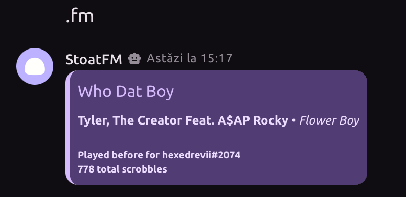

# StoatFM

Small, no-auth LastFM bot that shows what you're listening to!



# How to use

You need to set your LastFM username (or.. anyone's, really.)
```
.register <username>
```

Now, you can use `.fm` to see what you're currently listening to.
```bash
.fm

# You can also ping a user to see what they're listening to if they set a username
.fm @user
```

# Building
To build the bot, you will need .NET, SQLite3, a LastFM API Key, and a Stoat bot token.

### Getting the source code and setting up data

```bash
git clone https://github.com/hexedrevii/StoatFM

cd StoatFM/StoatFM
```

Now, you will need to set the user secrets.
```bash
dotnet user-secrets set "Token" "YOUR_TOKEN"
dotnet user-secrets set "LastFMKey" "YOUR_KEY"
```

### Initialising the database

In `appsettings.json` you will see something like this:
```json
{
  ...

  "AppSettings": {
    "SQLitePath": ""
  }
}
```

In SQLitePath, you will need to plug in the path to your database.

Now, you will need to let dotnet create the database using efcore.

```bash
# Install the efcore command
dotnet tool install --global dotnet-ef

# Initialise the database
dotnet ef migrations add InitialCreate
dotnet ef database update
```

### Running

You are now free to run the app.
```bash
dotnet run
```
